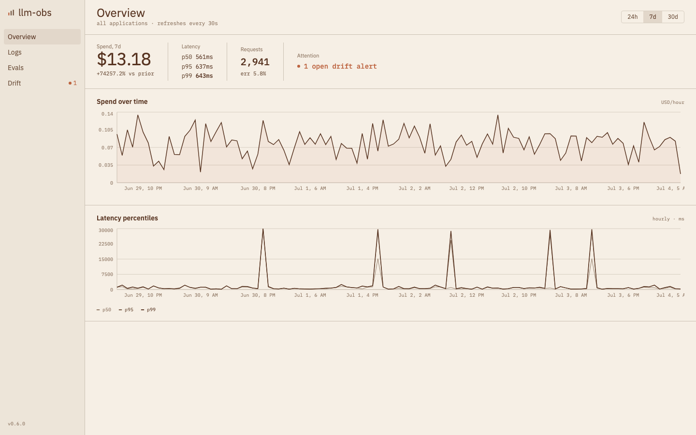
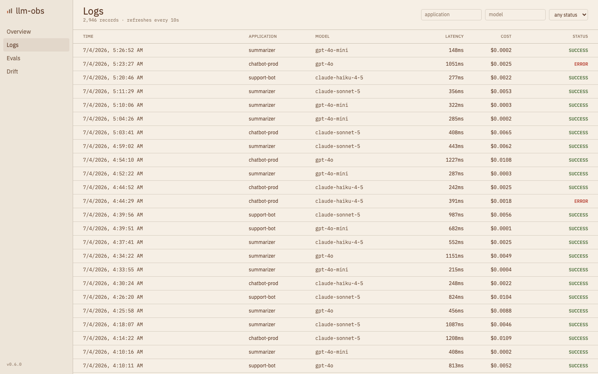
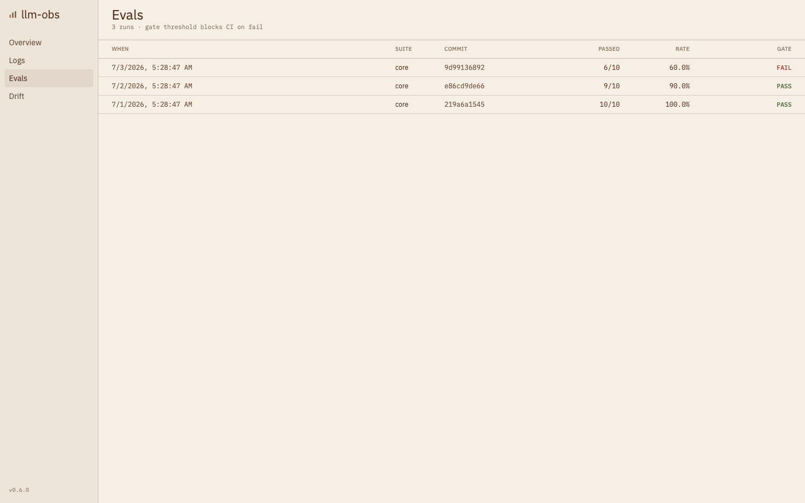
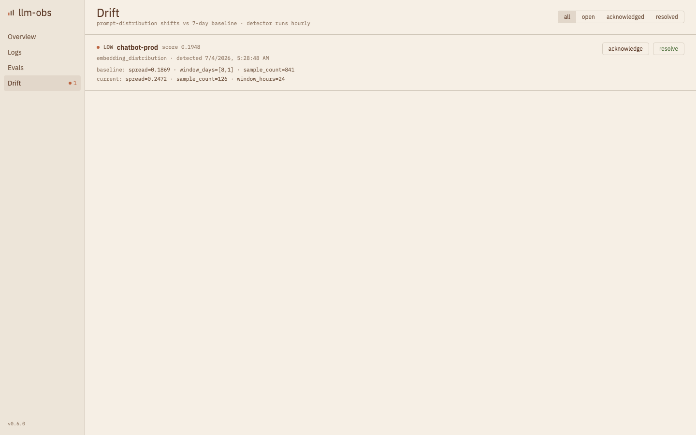
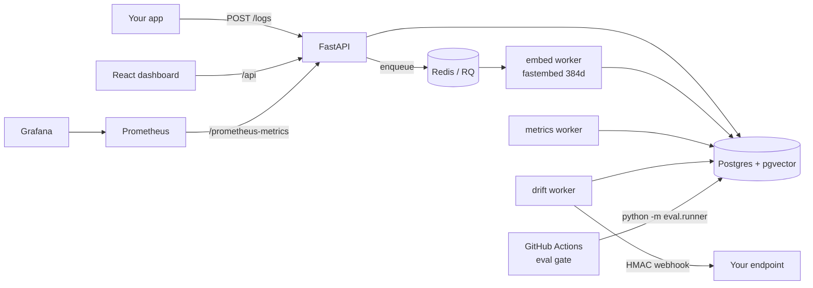

# LLM Observability Platform

**Self-hostable LLM evaluation, cost, and drift observability — $0 to run.**

[](https://github.com/Aite09/LLM-Observability-Platform/actions/workflows/ci.yml)
[](https://github.com/Aite09/LLM-Observability-Platform/actions/workflows/eval-gate.yml)
[](pyproject.toml)
[](api/main.py)
[](frontend/package.json)
[](api/models/llm_log.py)
[](LICENSE)

Every LLM call your app makes, logged. Every deploy, gated on eval pass-rate before
it ships. Every silent shift in what users are asking, caught before it becomes an
incident. One platform, one `docker compose up`, and it costs **nothing** to run —
embeddings are computed on-device, the eval judge defaults to a free deterministic
heuristic, and the only paid API in the entire codebase is opt-in behind an env var
nobody has to set.

This isn't a notebook. It's an async FastAPI backend with a real service layer,
Alembic-migrated schema, background workers, a signed-webhook alerting pipeline, an
OpenTelemetry/Prometheus/Grafana observability stack, and a hand-designed React
dashboard — backed by **49 passing tests** and a CI pipeline that gates its own
eval suite the same way it'd gate yours.

---

## Screenshots

<table>
<tr>
<td width="50%">

**Overview** — spend, latency percentiles, error rate, and open alerts at a glance


</td>
<td width="50%">

**Logs** — every call, filterable, with a full request/response drawer


</td>
</tr>
<tr>
<td width="50%">

**Evals** — CI gate history, pass rate, per-case scorer breakdown


</td>
<td width="50%">

**Drift** — real detector output: severity, score, baseline vs. current stats


</td>
</tr>
</table>

Every number in these screenshots comes from a real run against seeded data: 2,946
locally-embedded logs, a genuine 0.1948 cosine-drift score computed by the actual
detector (not hardcoded), and percentiles computed live by Postgres `percentile_cont`.

---

## Architecture



Routers hold no business logic — every request flows `router → service → ORM`.
`eval/` and `monitor/` are standalone packages with zero FastAPI imports, so the
eval engine and drift detector can run from a bare CLI in CI with no web server.

---

## Quickstart

```bash
git clone https://github.com/Aite09/LLM-Observability-Platform.git
cd LLM-Observability-Platform
cp .env.example .env
docker compose up -d              # postgres, redis, api, workers, prometheus, grafana
alembic upgrade head               # apply schema
python -m scripts.seed             # demo data, ~2 min (local embeddings)
cd frontend && npm install && npm run dev   # dashboard :5173
```

Then open:

| | |
|---|---|
| Dashboard | http://localhost:5173 |
| API docs | http://localhost:8000/docs |
| Grafana | http://localhost:3000 (anonymous admin) |
| Prometheus | http://localhost:9090 |

The seed script generates ~2,950 realistic logs across 3 apps and 4 models over 7
days — with a genuine topic shift on `chatbot-prod` in the most recent 24h window —
an eval suite with 3 historical runs, hourly/daily rollups, and a drift alert fired
by the real detector math. All local, all free.

---

## Features

**CI/CD eval gate.** `eval-gate.yml` runs `python -m eval.runner` against a test
suite on every pull request and exits non-zero when the pass rate falls below
`EVAL_GATE_THRESHOLD` (default `0.8`), blocking the merge. Each case is scored by
any combination of exact-match, embedding-similarity, and LLM-judge; a case passes
only when **all** its configured scorers pass — no averaging away a hard failure.

**Production LLM logger.** `POST /logs` records prompt, response, token counts,
cost, latency, time-to-first-token, status, OpenTelemetry trace/span IDs, and free
tags. The prompt is embedded asynchronously (384-dim, on-device) via a Redis/RQ
queue so drift detection has data without blocking the request path. `GET /logs`
filters by application, model, status, and time range with pagination.

**Input drift detection.** A background worker compares each application's
last-24h prompt-embedding centroid against its 7-day baseline using cosine
distance. When the shift clears a severity floor (`low`/`medium`/`high`/`critical`)
it opens a `drift_alert` and fires an **HMAC-SHA256-signed** webhook so a receiver
can verify authenticity. Alerts at the same-or-lower severity dedupe against an
existing open alert, so a persistent shift doesn't spam the same channel forever.

**React dashboard.** Four pages — Overview (spend, latency p50/p95/p99, request/error
rates, open-alert banner), Logs (filterable ledger + detail drawer), Evals (runs,
gate verdicts, per-case scores with judge reasoning), and Drift (alerts with
acknowledge/resolve). Data refreshes on an interval via TanStack Query; alert
actions are optimistic with automatic rollback on failure.

---

## Engineering decisions worth knowing about

A few choices that weren't the "obvious" default, and why:

- **Percentiles computed in Postgres (`percentile_cont`), not in application code.**
  Pulling every raw latency value into Python to sort it doesn't scale past a few
  thousand rows per window. The aggregator does one `GROUP BY` with in-DB
  percentile functions per (app, model, hour) — sorting stays where the data lives.
- **Drift score is centroid cosine distance, not a heavier statistical test.**
  KL-divergence or MMD would need density estimation over 384 dimensions, which is
  expensive and fragile at the sample sizes a single application actually produces
  in a day. Centroid drift is cheap, explainable in one sentence to a non-ML
  stakeholder, and catches the mean-shift case that matters most in practice — the
  tradeoff is documented, not hidden.
- **The eval engine takes a `generate_fn: Callable[[str], Awaitable[str]]`, defaulting
  to an echo target.** This keeps the full scorer/gate pipeline runnable and
  testable in CI with zero external calls, while making "point it at your real
  model" a one-argument change, not a rewrite.
- **Local embeddings (fastembed/ONNX) instead of an API.** Every drift detection,
  every embedding-similarity score, and the entire demo seed run without an API
  key. The cost of that decision is 384 dimensions instead of 1536 and a slightly
  weaker embedding model — worth it for a self-hostable tool where "works with zero
  configured secrets" is a real feature, not a limitation.
- **Alembic migrations even for a solo project.** The `Vector(1536) → Vector(384)`
  migration (dropping and recreating the column, since `ALTER TYPE` can't change
  pgvector dimensions) is in the migration history, not hand-patched into the
  schema — so the schema's history is the actual source of truth.

---

## Zero-cost design

Everything above runs for **$0**. The one paid path is fully opt-in and off by default.

| Concern | Default (free) | How it works |
|---------|----------------|--------------|
| Embeddings | `fastembed` (BAAI/bge-small-en-v1.5) | On-device ONNX, 384-dim, no API key |
| LLM judge | `mock` provider | Deterministic Jaccard token-overlap heuristic |
| Metrics/percentiles | Postgres `percentile_cont` | Computed in-DB, no external service |
| Tracing | no-op | OTEL only exports if `OTEL_EXPORTER_OTLP_ENDPOINT` is set |
| Hosting | Docker Compose | Local containers only |
| CI | GitHub Actions free tier | `JUDGE_PROVIDER=mock` pinned in CI |

**Opting into the real Claude judge** (costs pennies per run): set
`JUDGE_PROVIDER=anthropic` and `ANTHROPIC_API_KEY=...` in `.env`. The judge then
calls `claude-haiku-4-5` with exponential-backoff retries. Nothing else in the
system changes; leave it unset and the platform stays at $0 forever.

---

## Eval gate

The gate is a plain CLI, so it runs identically in CI and on your laptop:

```bash
python -m eval.runner --suite core --commit-sha "$GITHUB_SHA" --threshold 0.8
# exit 0 = gate pass, exit 1 = gate fail (or error) → CI blocks the merge
```

By default the runner uses an **echo target** (the system-under-test returns the
expected output), so the full scoring machinery — exact-match, embedding
similarity, LLM judge, pass/fail aggregation, gate threshold — is demonstrable end
to end with zero API calls. To gate a real model, pass an async
`generate_fn(prompt) -> str` to `run_eval` that calls your application; the same
scorers and threshold apply unchanged.

---

## Design system — "Linen Terminal"

The dashboard deliberately avoids the generic dark-mode-SaaS look. It's a warm
linen background with coffee-brown ink, terracotta reserved **strictly** for
things that need attention (drift alerts, error states — never decoration), and
the retro-block **Jersey 25** display face paired with **IBM Plex Sans/Mono** for
UI and tabular data. Layout is an editorial ledger — ruled rows and ledger strips,
no card grids — and every text/background pair meets **WCAG AA** contrast with
visible keyboard focus rings and `prefers-reduced-motion` support.

---

## Stack

| Layer | Tech |
|-------|------|
| Backend | Python 3.11, FastAPI, fully async |
| DB driver | asyncpg, SQLAlchemy 2.0 async |
| Databases | PostgreSQL 15+ with pgvector, Redis 7 |
| Evals | LLM-as-judge (mock default / Claude optional), embedding cosine similarity, exact match |
| Embeddings | fastembed (BAAI/bge-small-en-v1.5, on-device) |
| Observability | OpenTelemetry, Prometheus, Grafana |
| Frontend | React 18, TypeScript, Vite, Tailwind CSS, Recharts, TanStack Query |
| Config | Pydantic v2 + pydantic-settings |
| Migrations | Alembic |
| Infra | Docker Compose (local) |
| CI/CD | GitHub Actions |

---

## Development

```bash
pip install -e ".[dev]"
pytest tests/unit             # fast, no DB — 25 pure-logic scorer/embedding/webhook tests
pytest tests/integration      # needs postgres + redis — 24 tests against a real DB
ruff check .                  # lint, zero warnings
cd frontend && npm run build  # typecheck (strict) + production bundle
```

Project layout: `api/` (FastAPI — routers → services → models/schemas, no logic in
handlers), `eval/` (standalone eval engine + scorers, zero FastAPI imports),
`monitor/` (drift detector, metrics aggregator, webhook dispatch — also standalone),
`workers/` (RQ jobs + loop-daemon workers), `frontend/` (React dashboard),
`infra/` (Docker, Prometheus, Grafana provisioning), `scripts/` (demo seeder).

---

## Honest scope

This is a portfolio-grade reference implementation, not a claim of production
battle-testing. Specifically:

- The seed data is synthetic (fabricated prompts/costs/latencies), generated to
  exercise every code path realistically — it is not real production traffic.
- Demo scale is ~3,000 log rows; the percentile/drift math is real, but it hasn't
  been load-tested at the volume a high-traffic production deployment would see.
- No auth/multi-tenancy layer — every endpoint is open, by design, for a
  self-hosted single-tenant deployment.
- Grafana/Prometheus are configured and provisioned but optional; the core
  product (logger, eval gate, drift detection, dashboard) does not depend on them.

If you're evaluating this as a hiring signal: the interesting parts are the async
architecture, the standalone-package discipline in `eval/`/`monitor/`, the
migration history, and the 49 tests — not the seeded numbers on the dashboard.

---

## License

[MIT](LICENSE)
