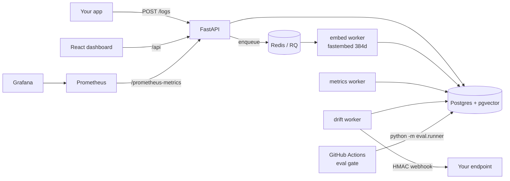

# LLM Observability Platform

**Self-hostable LLM evaluation & observability platform. $0 to run.**

[](https://github.com/Aite09/LLM-Observability-Platform/actions/workflows/ci.yml)
[](https://github.com/Aite09/LLM-Observability-Platform/actions/workflows/eval-gate.yml)

Log every LLM call, gate deploys on eval pass-rate, catch input drift, and watch
cost/latency/errors on a dashboard — all running locally with **no paid APIs**.
Embeddings are computed on-device (fastembed/ONNX) and the LLM-judge defaults to a
free deterministic heuristic, so the demo, tests, and CI make **zero billed calls**.

---

## Architecture



---

## Quickstart

```bash
git clone https://github.com/Aite09/LLM-Observability-Platform.git
cd LLM-Observability-Platform
cp .env.example .env
docker compose up -d              # postgres, redis, api, workers, prometheus, grafana
alembic upgrade head              # apply schema
python -m scripts.seed            # demo data, ~2 min (local embeddings)
uvicorn api.main:app --reload     # API :8000  (also run by compose)
cd frontend && npm install && npm run dev   # dashboard :5173
```

Then open:

- **Dashboard** — http://localhost:5173
- **API docs** — http://localhost:8000/docs
- **Grafana** — http://localhost:3000 (anonymous admin)
- **Prometheus** — http://localhost:9090

The seed script generates ~3,000 realistic logs across 3 apps and 4 models over 7
days (with a genuine day-6/7 topic shift on `chatbot-prod`), an eval suite with 3
historical runs, hourly/daily rollups, and one real drift alert — all with local
embeddings, costing nothing.

---

## Features

**CI/CD eval gate.** `eval-gate.yml` runs `python -m eval.runner` against a test
suite on every pull request and exits non-zero when the pass rate falls below
`EVAL_GATE_THRESHOLD` (default 0.8), blocking the merge. Each case is scored by any
combination of exact-match, embedding-similarity, and LLM-judge; a case passes only
when **all** its configured scorers pass.

**Production LLM logger.** `POST /logs` records prompt, response, token counts,
cost, latency, time-to-first-token, status, OpenTelemetry trace/span IDs, and free
tags. The prompt is embedded asynchronously (384-dim, on-device) so drift detection
works without blocking the request. `GET /logs` filters by application, model, and
status with pagination.

**Input drift detection.** A background worker compares each application's last-24h
prompt-embedding centroid against its 7-day baseline (cosine distance). When the
shift clears the severity floor it opens a `drift_alert` and fires an
**HMAC-SHA256-signed** webhook. Repeat alerts of the same-or-lower severity are
deduplicated so a persistent shift doesn't spam.

**React dashboard.** Four pages — Overview (spend, latency p50/p95/p99, request/error
rates), Logs (filterable ledger + detail drawer), Evals (runs, gate results, per-case
scores with judge reasoning), and Drift (alerts with acknowledge/resolve). Data
refreshes on an interval via TanStack Query; alert actions are optimistic.

---

## Zero-cost design

Everything runs locally for **$0**. The one optional paid path is fully opt-in.

| Concern | Default (free) | How it works |
|---------|----------------|--------------|
| Embeddings | `fastembed` (BAAI/bge-small-en-v1.5) | On-device ONNX, 384-dim, no API key |
| LLM judge | `mock` provider | Deterministic Jaccard token-overlap heuristic |
| Metrics/percentiles | Postgres `percentile_cont` | Computed in-DB, no external service |
| Tracing | no-op | OTEL only exports if `OTEL_EXPORTER_OTLP_ENDPOINT` is set |
| Hosting | Docker Compose | Local containers only |
| CI | GitHub Actions free tier | `JUDGE_PROVIDER=mock` pinned in CI |

**Opting into the real Claude judge** (optional, costs pennies per run): set
`JUDGE_PROVIDER=anthropic` and `ANTHROPIC_API_KEY=...` in `.env`. The judge then
calls `claude-haiku-4-5` with retries. Nothing else changes; leave it unset to stay
at $0.

---

## Eval gate

The gate is a plain CLI, so it runs identically in CI and locally:

```bash
python -m eval.runner --suite core --commit-sha "$GITHUB_SHA" --threshold 0.8
# exit 0 = gate pass, exit 1 = gate fail (or error) → CI blocks the merge
```

By default the runner uses an **echo target** (the system-under-test returns the
expected output) so the full scoring machinery is demonstrable with zero cost. To
gate a real model, pass an async `generate_fn(prompt) -> str` to `run_eval` that
calls your application, and the same scorers/threshold apply.

---

## Design system

The dashboard is **"Linen Terminal"**: a warm linen background with coffee-brown ink,
terracotta reserved strictly for attention (drift/alerts), and the retro-block
**Jersey 25** display face paired with **IBM Plex Sans/Mono** for UI and data. Layout
is an editorial ledger — ruled rows, tabular figures, no card grids — and every text
pair meets **WCAG AA** contrast with visible keyboard focus and reduced-motion support.

---

## Stack

| Layer | Tech |
|-------|------|
| Backend | Python 3.11, FastAPI, fully async |
| DB driver | asyncpg, SQLAlchemy 2.0 async |
| Databases | PostgreSQL 15 + pgvector, Redis 7 |
| Evals | LLM-as-judge (mock default / Claude optional), embedding cosine similarity, exact match |
| Embeddings | fastembed (BAAI/bge-small-en-v1.5, on-device) |
| Observability | OpenTelemetry, Prometheus, Grafana |
| Frontend | React 18, TypeScript, Vite, Tailwind CSS, Recharts, TanStack Query |
| Config | Pydantic v2 + pydantic-settings |
| Migrations | Alembic |
| Infra | Docker Compose (local) |
| CI/CD | GitHub Actions |

---

## Development

```bash
pip install -e ".[dev]"
pytest tests/unit            # fast, no DB
pytest tests/integration     # needs postgres + redis (docker compose up -d)
ruff check .                 # lint
cd frontend && npm run build # typecheck + bundle
```

Project layout: `api/` (FastAPI: routers → services → models/schemas), `eval/`
(standalone eval engine + scorers), `monitor/` (drift detector, aggregator,
webhooks), `workers/` (RQ + loop daemons), `frontend/` (React dashboard), `infra/`
(Docker, Prometheus, Grafana), `scripts/` (seed).
